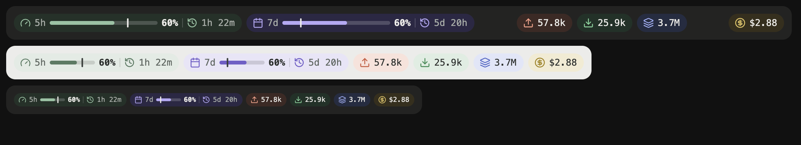

# usage-bar

A row of pills above the Claude Code prompt showing how much of your plan you've used, how fast, and what this session has cost. It stretches to the band's width and follows your light or dark theme.



| Pill | Meaning |
| --- | --- |
| gauge **5h** | 5-hour rate-limit window: bar with % used, then time until it resets |
| calendar **7d** | 7-day window, same layout |
| tick inside a bar | **Pace marker**: how much of the window's time has passed. Fill short of the tick means you're under pace; past it, you're using it faster than it refills |
| upload | Input tokens sent this session (uncached + cache writes) |
| download | Output tokens generated this session |
| layers | Input tokens served from the prompt cache this session |
| dollar | Session cost in USD (the same figure as `/cost`) |

Rate-limit pills appear only on a Claude subscription (Pro / Max); the cost pill only where Claude Code keeps a cost ledger.

## Where it works

| Claude Code surface | Supported | How it shows |
| --- | :---: | --- |
| Claude desktop app, Code tab | ✅ | Band above the prompt: SVG pills, colors follow the app's light/dark theme |
| Terminal (CLI), incl. VS Code / JetBrains integrated terminal | ✅ | Band above the prompt: text with Unicode glyphs, colored by your `/theme` |
| VS Code extension panel | ✅ | **Pane**, opened automatically when VS Code joins the session (the extension has no band above the prompt) |
| Claude mobile app (Remote Control) | ⚠️ text | Run `/usage`: shows a text summary (% used, pace, reset time, tokens, cost). A phone following a session over Remote Control mirrors the transcript as text and never asks mods to draw |
| Any surface | ✅ | `/usage` prints the summary; surfaces that draw mod UI (desktop, VS Code) replace it with live pills and also open the pane |

The mod runs inside Claude Code on the machine where it's installed. The desktop app and VS Code are *remote surfaces*: they ask that Claude Code what to draw, so there is nothing to install in the extension. Tested 2026-10-03: a phone following a desktop session over Remote Control does not attach as a drawing surface (it only mirrors transcript text), so `/usage` falls back to its text summary there.

## Install

Requires Claude Code 2.1.286 or newer.

**Desktop app and terminal**: run once in any shell; both read the same `~/.claude` config:

```bash
claude plugin marketplace add ravipatel7/claude-mods
claude plugin install usage-bar@claude-mods
```

Then start a new Code session in the desktop app, or a new `claude` session in the terminal.

Inside a terminal session you can do the same with `/plugin marketplace add ravipatel7/claude-mods` and `/plugin install usage-bar@claude-mods`.

**Try it without installing:**

```bash
claude --plugin-dir /path/to/claude-mods/mods/usage-bar
```

## Update

```bash
claude plugin marketplace update claude-mods
claude plugin update usage-bar@claude-mods
```

## Uninstall

```bash
claude plugin uninstall usage-bar@claude-mods
```

Hide it for a moment without uninstalling: collapse the band with `ctrl+x ctrl+a`.

## How it works

`hooks/register.tsx` hooks four events:

- `session.start` seeds rate limits and cost from `$.session.usage()` and starts a one-minute tick for the reset countdowns.
- `session.measure`: Claude Code pushes fresh rate-limit and cost figures after each turn.
- `turn.complete` adds each turn's token usage (subagents included) to the running totals.
- `ui.render` on `AbovePrompt` draws the row and steps aside while a survey uses the band.
- `ui.render` on the `usage-bar` **Pane** draws the same row; `/usage` (a registered command) opens it and draws the same live row in its own output row (`CommandOutput`, raised on every surface), and `session.start` / `session.attach` open it automatically when a VS Code client is attached.

On the desktop the row is one SVG sized to the band: the usage bars stretch first, leftover space separates the limits / tokens / cost groups, and on a narrow band the row scales down rather than wrapping. If it would shrink by more than 15% (a phone), it stacks into two rows instead: limits on top, tokens and cost below, both rows at the same scale. Colors are CSS variables switched by `prefers-color-scheme`. Icons are from [Lucide](https://lucide.dev) (ISC license).

Values live in `$.state` (declared in `types/index.d.ts`): totals survive a reload of the mod and reset with each new session.

## Configure / develop

Constants at the top of `hooks/register.tsx`:

- `TINTS`: light and dark background/accent pair per pill
- `ICONS`: SVG paths
- `H`, `PAD`, `BAR_W`, `BAR_MAX`: pill geometry
- `CELL_PX`: px per column the desktop reports (7.8 by default). If the row stops short of, or overshoots, the band's right edge, adjust this.

```bash
claude plugin validate mods/usage-bar
```
